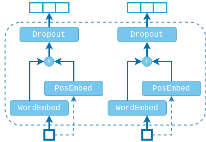
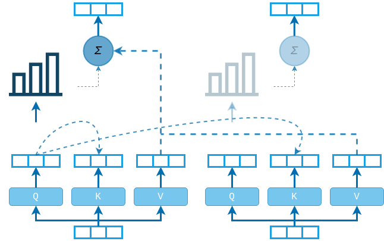
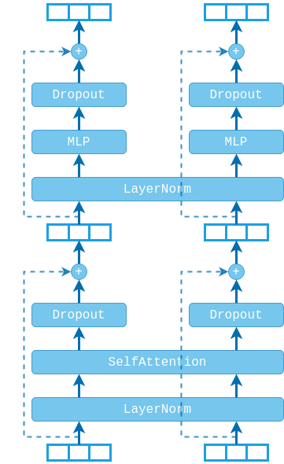
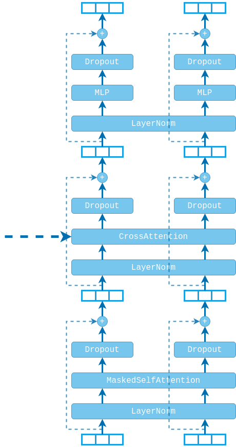
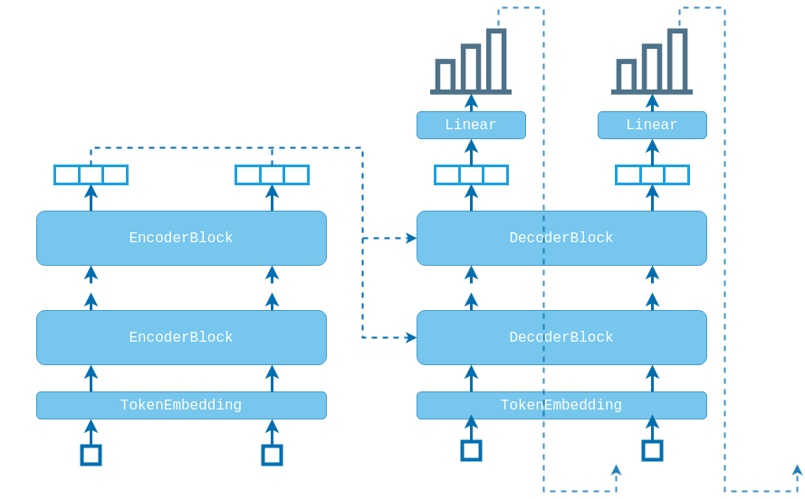

# TRANSFORMER

The transformer model was first introduced in the paper:
 * "Attention is all you need" by Vaswani et. al.,
 ([here](https://arxiv.org/abs/1706.03762))

For a really thorough and in-depth discussion of the implementation of the
Transformer you can check out a
[blog post](https://pi-tau.github.io/posts/transformer/) that I wrote about it.

The transformer is used for modelling sequence-to-sequence tasks (like machine
translation), where the input sequence is encoded using an encoder and then the
output sequence is produced using a decoder.


## TOKEN EMBEDDING
Before feeding the sequence to the transformer we have to pass the tokens through
a standard embedding layer. We also need to encode the order of the sequence,
since order information is not built-in. Thus, we use a position embedding layer,
that maps each sequence index to a vector. The word embedding and the position
embedding are then added and dropout is applied to produce the final token
embedding.

```math
\begin{aligned}
    TokenEmbed(elem_i): \\
        & emb_i = WordEmbed(elem_i) + PosEmbed(i) \\
        & x_i = Dropout(emb_i)
\end{aligned}
```




## ATTENTION
The query, key and value linear layers ($Q$, $K$, $V$) are used to encode the
input. Dot-products between query and key vectors produces the attention scores,
which are used to perform weighted summation of the value vectors.
Dropout is applied to the attention weights directly before the summation.



Each self-attention block has several sets of $Q$, $K$ and $V$ layers. Each set
is called an *attention head*.


## ENCODER
The encoder consists of $N$ identical blocks applied one after another. Each
encoder block has two sub-layers: a self-attention layer followed by a
position-wise fully-connected network. The block also incorporates layer
normalization layers which are added before the sub-layers, and dropout layers
added after the sub-layers. Finally, a residual connection is applied after both
the self-attention and the fully-connected layers.

```math
\begin{aligned}
    Encoder(x): \\
        & z = x + Dropout(Attn(Norm(x))) \\
        & r = z + Dropout(FFCN(Norm(z)))
\end{aligned}
```




## DECODER
The decoder is also composed of $N$ identical blocks. The decoder block is very
similar to the encoder block, but with two differences:
1. The decoder uses *masked* self-attention, meaning that current sequence
elements cannot attend future elements.
2. In addition to the two sub-layers, the decoder uses a third sub-layer, which
performs cross-attention between the decoded sequence and the outputs of the
encoder.

```math
\begin{aligned}
    Decoder(x): \\
        & z = x + Dropout(MaskAttn(Norm(x))) \\
        & c = z + Dropout(CrossAttn(Norm(z))) \\
        & r = c + Dropout(FFCN(Norm(c)))
\end{aligned}
```




## TRANSFORMER
The full transformer model is constructed by plugging in the outputs of the
final encoder block to the cross-attention layer of every decoder block.
Finally, the outputs of the final decoder block are forwarded through a linear
layer to produce scores over the target vocabulary.


